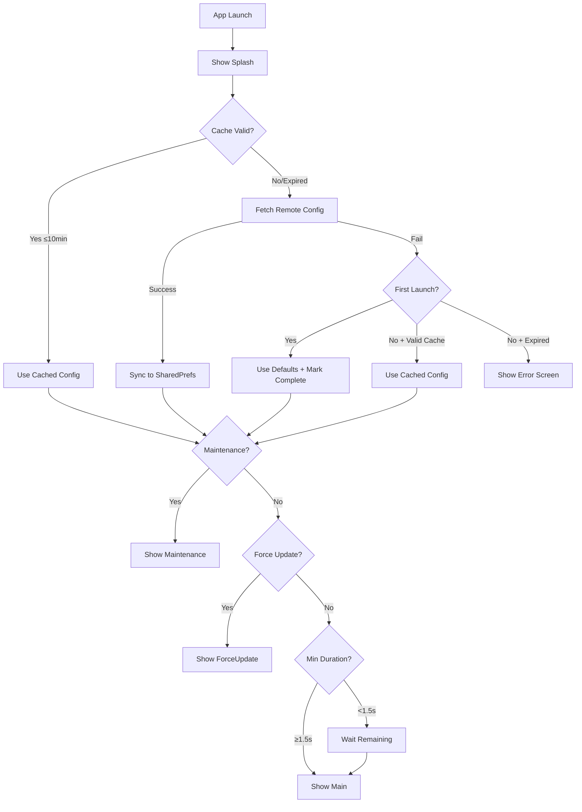

# Android App Module Specification

## 1. 개요 (Overview)

TMA Android 프로젝트의 **App 모듈**에 대한 기술 요구사항 명세서입니다.

### 1.1. 요구 기술 스택
| 항목 | 요구사항 |
|:---|:---|
| **Language** | Kotlin |
| **UI Framework** | Jetpack Compose (Material 3) |
| **Architecture** | MVI (Unidirectional Data Flow) |
| **DI** | Hilt (Dagger) |
| **Async** | Kotlin Coroutines + Flow |
| **Build System** | Gradle 8.0+ (Kotlin DSL) |
| **Minimum SDK** | API 24 (Android 7.0) |
| **Target SDK** | API 35 (Android 15) |

### 1.2. 핵심 파일 구조
```
app/src/main/kotlin/{{ package }}/
├── TmaApplication.kt     # @HiltAndroidApp 진입점
├── MainActivity.kt       # @AndroidEntryPoint + NavHost
├── AppState.kt           # @Singleton 전역 상태
├── lifecycle/
│   ├── AppLifecycleManager.kt    # 시작 시퀀스 관리
│   ├── AppStartupState.kt        # sealed interface 상태
│   ├── UpdateChecker.kt          # 버전 비교 유틸
│   └── StoreVersionChecker.kt    # Play Store 버전 조회
├── ui/
│   ├── SplashScreen.kt
│   ├── MaintenanceScreen.kt
│   ├── ForceUpdateScreen.kt
│   └── ErrorScreen.kt
├── deeplink/
│   └── DeepLinkHandler.kt
└── di/
    └── AppModule.kt      # Hilt 모듈 (Remote Config 등)
```

---

## 2. 앱 라이프사이클 (App Lifecycle)

### 2.1. 화면 상태 (AppStartupState)

```kotlin
sealed interface AppStartupState {
    data object Splash : AppStartupState
    data class Loading(val progress: Float, val message: String) : AppStartupState
    data class Maintenance(val message: String) : AppStartupState
    data class ForceUpdate(val currentVersion: String, val requiredVersion: String, val updateUrl: String) : AppStartupState
    data class Error(val message: String, val throwable: Throwable?, val isRetryable: Boolean) : AppStartupState
    data object Ready : AppStartupState
}
```

| 우선순위 | 상태 | 트리거 조건 | 사용자 액션 |
|:---:|:---|:---|:---|
| 1 | `Maintenance` | `isMaintenanceMode == true` | 재시도 버튼 |
| 2 | `ForceUpdate` | `currentVersion < minimumVersion` | Play Store 이동 |
| 3 | `Error` | 캐시 만료 + 네트워크 실패 | 재시도 버튼 |
| 4 | `Ready` | 모든 검증 통과 + 최소 스플래시 시간 | - |
| 5 | `Splash`/`Loading` | 앱 시작 / 캐시 만료 후 Foreground | - |

### 2.2. Cold Start Sequence



### 2.3. Splash + Validation 동기화

스플래시 화면은 **두 조건이 모두 충족**될 때만 종료됩니다:

| 조건 | 소스 | 시간 |
|:---|:---|:---|
| 최소 스플래시 시간 | `SPLASH_MIN_DURATION_MS` | **1.5초** |
| Remote Config 검증 완료 | `AppLifecycleManager` | ~1-3초 |

```kotlin
companion object {
    private const val SPLASH_MIN_DURATION_MS = 1500L
}

// Ensure minimum splash duration
val elapsed = System.currentTimeMillis() - startTime
if (elapsed < SPLASH_MIN_DURATION_MS) {
    delay(SPLASH_MIN_DURATION_MS - elapsed)
}
```

### 2.4. Foreground 복귀

| 캐시 상태 | 동작 | UI 변화 |
|:---|:---|:---|
| 유효 (< 10분) | 캐시로 즉시 maintenance/forceUpdate 검증 | 없음 |
| 만료 (≥ 10분) | 스플래시 표시 + Remote Config 재fetch | Splash 표시 |

### 2.5. 에러 시나리오 매트릭스

| # | 상황 | 캐시 | 네트워크 | 결과 |
|:---:|:---|:---:|:---:|:---|
| 1 | 첫 실행 | ❌ | ✅ | 정상 fetch → 검증 → Ready |
| 2 | 첫 실행 | ❌ | ❌ | 기본값 사용 → Ready |
| 3 | 재실행 | ✅ 유효 | ✅/❌ | 캐시 사용 → 즉시 검증 |
| 4 | 재실행 | ⏰ 만료 | ✅ | fetch → 검증 → Ready |
| 5 | 재실행 | ⏰ 만료 | ❌ | Error 화면 + 재시도 |
| 6 | Foreground | ✅ 유효 | - | 캐시로 즉시 검증 |
| 7 | Foreground | ⏰ 만료 | ✅ | Splash → fetch → Ready |
| 8 | Foreground | ⏰ 만료 | ❌ | Error 화면 |
| 9 | Maintenance | - | - | 재시도 → 해제 시 Ready |

---

## 3. Remote Config

### 3.1. 캐시 정책
| 설정 | 값 | 위치 |
|:---|:---|:---|
| 캐시 TTL | **10분 (600,000ms)** | `CACHE_TTL_MS` |
| 저장소 | SharedPreferences (`app_state`) | `AppState` |
| 타임스탬프 | Unix epoch (Long, millis) | `lastRemoteConfigSyncTimestamp` |

### 3.2. 캐시 검증
```kotlin
companion object {
    private const val CACHE_TTL_MS = 600_000L  // 10분
}

val hasCachedRemoteConfig: Boolean
    get() = lastRemoteConfigSyncTimestamp > 0

val isCacheValid: Boolean
    get() {
        if (!hasCachedRemoteConfig) return false
        val elapsed = System.currentTimeMillis() - lastRemoteConfigSyncTimestamp
        return elapsed < CACHE_TTL_MS
    }
```

### 3.3. 필수 Remote Config 키
| Key | Type | 기본값 | 용도 |
|:---|:---:|:---:|:---|
| `maintenance_mode_enabled` | Boolean | `false` | Kill Switch |
| `maintenance_message` | String | `""` | 점검 안내 문구 (JSON 다국어 지원) |
| `force_update_min_version` | String | `""` | 최소 요구 버전 (e.g., "1.2.0") |
| `welcome_message` | String | `"Welcome!"` | 스플래시/메인 환영 메시지 (JSON 다국어 지원) |

> **Note:** Analytics는 항상 활성화됩니다. Remote Config로 제어하지 않습니다.

---

## 4. 버전 비교 로직

### 4.1. Semantic Versioning
```kotlin
// UpdateChecker
fun isUpdateRequired(currentVersion: String, minimumVersion: String): Boolean {
    if (minimumVersion.isBlank()) return false
    return compareVersions(currentVersion, minimumVersion) < 0
}

private fun compareVersions(v1: String, v2: String): Int {
    val parts1 = v1.split(".").map { it.toIntOrNull() ?: 0 }
    val parts2 = v2.split(".").map { it.toIntOrNull() ?: 0 }
    val maxLen = maxOf(parts1.size, parts2.size)
    for (i in 0 until maxLen) {
        val p1 = parts1.getOrElse(i) { 0 }
        val p2 = parts2.getOrElse(i) { 0 }
        if (p1 != p2) return p1.compareTo(p2)
    }
    return 0
}
```

### 4.2. 비교 규칙
| 현재 버전 | 최소 버전 | 결과 |
|:---:|:---:|:---:|
| 1.0.0 | 1.0.0 | ✅ Pass |
| 1.0.1 | 1.0.0 | ✅ Pass |
| 1.0.0 | 1.0.1 | ❌ Force Update |
| 1.0.0 | 2.0.0 | ❌ Force Update |
| 1.0.0 | (blank) | ✅ Pass |

---

## 5. AppState (Hilt Singleton)

### 5.1. 주입 방식
```kotlin
@Singleton
class AppState @Inject constructor(
    @ApplicationContext private val context: Context
) { ... }

// 사용
@Inject lateinit var appState: AppState
```

### 5.2. Volatile State (StateFlow)
| 프로퍼티 | 타입 | 설명 |
|:---|:---|:---|
| `selectedTabIndex` | `StateFlow<Int>` | 선택된 탭 인덱스 |
| `isShowingOnboarding` | `StateFlow<Boolean>` | 온보딩 표시 여부 |
| `lastViewedScreen` | `StateFlow<String>` | 마지막 본 화면 |
| `isInForeground` | `StateFlow<Boolean>` | 포그라운드 상태 |
| `latestStoreVersionCode` | `StateFlow<Int?>` | 최신 스토어 버전 |

### 5.3. Persistent State (SharedPreferences)
| 프로퍼티 | 타입 | 설명 |
|:---|:---|:---|
| `forceUpdateMinimumVersion` | `String` | 최소 요구 버전 |
| `isMaintenanceMode` | `Boolean` | 점검 모드 여부 |
| `maintenanceMessage` | `JSON` | 점검 메시지 |
| `welcomeMessage` | `JSON` | 환영 메시지 |
| `lastRemoteConfigSyncTimestamp` | `Long` | 마지막 동기화 시간 |
| `isFirstLaunchComplete` | `Boolean` | 첫 실행 완료 여부 |

### 5.4. API
| 메서드 | 설명 |
|:---|:---|
| `syncFromRemoteConfig(repository)` | Remote Config → SharedPrefs 동기화 + 타임스탬프 갱신 |
| `markFirstLaunchComplete()` | 첫 실행 완료 마킹 |
| `resetVolatileState()` | 인메모리 상태 초기화 |
| `clearPersistentState()` | SharedPreferences 전체 초기화 |

---

## 6. 딥링크 (Deep Link)

### 6.1. 지원 스킴
| 유형 | 형식 |
|:---|:---|
| Custom Scheme | `{{ scheme }}://path` |
| App Link | `https://{{ domain }}/path` |

### 6.2. 딥링크 처리 흐름
1. `MainActivity.onCreate()` → `intent.data` 확인
2. `MainActivity.onNewIntent()` → 실행 중 수신
3. `NavController` or `ViewModel` → 라우팅 처리

### 6.3. AndroidManifest 설정
```xml
<intent-filter android:autoVerify="true">
    <action android:name="android.intent.action.VIEW" />
    <category android:name="android.intent.category.DEFAULT" />
    <category android:name="android.intent.category.BROWSABLE" />
    <data android:scheme="https" android:host="{{ domain }}" />
</intent-filter>
<intent-filter>
    <action android:name="android.intent.action.VIEW" />
    <category android:name="android.intent.category.DEFAULT" />
    <category android:name="android.intent.category.BROWSABLE" />
    <data android:scheme="{{ scheme }}" />
</intent-filter>
```

---

## 7. Kotlin 패턴

### 7.1. StateFlow for Reactive State
```kotlin
private val _startupState = MutableStateFlow<AppStartupState>(AppStartupState.Splash)
val startupState: StateFlow<AppStartupState> = _startupState.asStateFlow()
```

### 7.2. Sealed Interface for States
```kotlin
sealed interface AppStartupState {
    data object Splash : AppStartupState
    data class Loading(val progress: Float, val message: String) : AppStartupState
    data class Maintenance(val message: String) : AppStartupState
    data class ForceUpdate(
        val currentVersion: String,
        val requiredVersion: String,
        val updateUrl: String
    ) : AppStartupState
    data class Error(
        val message: String,
        val throwable: Throwable? = null,
        val isRetryable: Boolean = true
    ) : AppStartupState
    data object Ready : AppStartupState
}
```

### 7.3. Hilt Module
```kotlin
@Module
@InstallIn(SingletonComponent::class)
object AppModule {
    @Provides
    @Singleton
    fun provideRemoteConfigRepository(): RemoteConfigRepository {
        return FirebaseRemoteConfigRepository()
    }
}
```

---

## 8. UI 화면 명세

| 화면 | 파일 | 주요 기능 |
|:---|:---|:---|
| **SplashScreen** | `SplashScreen.kt` | 브릭 애니메이션, 로딩 진행률 표시, 최소 1.5초 |
| **MaintenanceScreen** | `MaintenanceScreen.kt` | 점검 메시지, 재시도 버튼 |
| **ForceUpdateScreen** | `ForceUpdateScreen.kt` | 최소 버전 안내, Play Store 링크 (`market://details?id=`) |
| **ErrorScreen** | `ErrorScreen.kt` | 에러 메시지, 재시도 버튼 |
| **MainScreen** | `HomeScreen.kt` | 앱 메인 콘텐츠 |

---

## 9. 다국어 지원 (Localization)

### 9.1. Remote Config 다국어 형식

Remote Config의 텍스트 값은 **JSON 형식**으로 여러 언어를 지원합니다:

```json
{
  "ko": "한국어 메시지",
  "en": "English message",
  "ja": "日本語メッセージ"
}
```

### 9.2. LocalizedRemoteConfig

`LocalizedRemoteConfig.kt`는 JSON 기반 다국어 값을 파싱합니다:

```kotlin
// 사용 예시
val rawValue = remoteConfigRepository.getString("maintenance_message")
val languageCode = appState.getUserLanguageCodeSync()
val localized = LocalizedRemoteConfig.localize(rawValue, languageCode)
```

### 9.3. AppState 다국어 API

| 메서드 | 타입 | 설명 |
|:---|:---|:---|
| `userLanguageCode` | Flow<String> | 사용자가 선택한 언어 (DataStore 저장) |
| `setUserLanguageCode(code)` | suspend | 사용자 언어 설정 |
| `getLocalizedWelcomeMessage()` | suspend | 다국어 처리된 환영 메시지 |
| `getLocalizedMaintenanceMessage()` | suspend | 다국어 처리된 점검 메시지 |

### 9.4. Fallback 정책

1. 사용자 선택 언어 (`userLanguageCode`)
2. 영어 (`en`)
3. 빈 문자열 (`""`)

---

## 10. 상태 관리 전략

### 10.1. Persistent State (DataStore Preferences)

`DataStore`를 사용하여 앱 재시작 후에도 유지:

| 키 | 타입 | 용도 |
|:---|:---:|:---|
| `forceUpdateMinVersion` | String | 최소 요구 버전 |
| `maintenanceMode` | Boolean | 점검 모드 플래그 |
| `maintenanceMessage` | String | 점검 메시지 |
| `welcomeMessage` | String | 환영 메시지 |
| `lastRemoteConfigSync` | Long | 마지막 동기화 시간 |
| `isFirstLaunchComplete` | Boolean | 첫 실행 완료 여부 |
| `userLanguageCode` | String | 사용자 언어 설정 |

### 10.2. Volatile State (StateFlow)

`MutableStateFlow`를 사용하여 앱 재시작 시 초기화:

| 키 | 타입 | 용도 |
|:---|:---:|:---|
| `selectedTabIndex` | StateFlow<Int> | 현재 선택된 탭 |
| `isShowingOnboarding` | StateFlow<Boolean> | 온보딩 표시 여부 |
| `lastViewedScreen` | StateFlow<String> | 마지막 본 화면 |
| `isInForeground` | StateFlow<Boolean> | 앱 포그라운드 상태 |
| `latestStoreVersionCode` | StateFlow<Int?> | Play Store 최신 버전 |

### 10.3. 상태 초기화 API

```kotlin
// Volatile state만 초기화
appState.resetVolatileState()

// 모든 persistent state 삭제 (위험!)
appState.clearPersistentState()
```

---

## 11. 앱 상수 관리

### 11.1. AppConstants

모든 앱 상수를 중앙 관리하는 `AppConstants` 객체:

```kotlin
object AppConstants {
    // App Info
    const val PACKAGE_NAME = "{{ cookiecutter.base_package }}"

    // Play Store
    const val PLAY_STORE_URL_PREFIX = "https://play.google.com/store/apps/details?id="

    fun getPlayStoreUrl(packageName: String = PACKAGE_NAME): String {
        return "$PLAY_STORE_URL_PREFIX$packageName"
    }
}

object RemoteConfigKeys {
    const val FORCE_UPDATE_MIN_VERSION = "force_update_min_version"
    const val MAINTENANCE_MODE_ENABLED = "maintenance_mode_enabled"
    const val MAINTENANCE_MESSAGE = "maintenance_message"
    const val WELCOME_MESSAGE = "welcome_message"
}
```

### 11.2. UpdateChecker Play Store URL

`UpdateChecker`는 `packageName`을 받아 Play Store URL을 생성합니다:

```kotlin
override fun getStoreUrl(packageName: String): String {
    return "https://play.google.com/store/apps/details?id=$packageName"
}
```

> **권장사항:** `AppConstants.getPlayStoreUrl()`을 사용하여 중앙 집중식 관리

---

## 12. Firebase 연동 세부사항

### 12.1. google-services.json 검증

Firebase 연동은 선택적이며, google-services.json이 없어도 앱이 동작합니다:

```kotlin
// LocalRemoteConfigRepository가 기본값으로 대체
if (!File("google-services.json").exists()) {
    // Use local defaults
}
```

### 12.2. Remote Config 기본값

`RemoteConfigDefaults.kt`에 다국어 기본값 제공:

```kotlin
object RemoteConfigDefaults {
    val defaults: Map<String, Any> = mapOf(
        RemoteConfigKeys.FORCE_UPDATE_MIN_VERSION to "",
        RemoteConfigKeys.MAINTENANCE_MODE_ENABLED to false,
        RemoteConfigKeys.MAINTENANCE_MESSAGE to """{"ko":"...","en":"..."}""",
        RemoteConfigKeys.WELCOME_MESSAGE to """{"ko":"...","en":"..."}"""
    )
}
```

---

## 13. DataStore vs SharedPreferences

### 13.1. DataStore 선택 이유

| 특성 | SharedPreferences | DataStore |
|:---|:---:|:---:|
| Type Safety | ❌ | ✅ |
| Async API | ❌ | ✅ |
| Flow 지원 | ❌ | ✅ |
| 트랜잭션 안전성 | ❌ | ✅ |
| Coroutine 통합 | ❌ | ✅ |

### 13.2. iOS swift-sharing과의 철학적 대응

| iOS | Android | 철학 |
|:---|:---|:---|
| `@Shared(.appStorage)` | DataStore Preferences Flow | 영구 저장, 반응형 |
| `@Shared(.inMemory)` | StateFlow | 휘발성, 반응형 |
| `withLock { }` | `dataStore.edit { }` | 트랜잭션 안전성 |

---

## 14. iOS vs Android 비교

| 항목 | iOS | Android |
|:---|:---|:---|
| **상태 관리** | TCA Reducer + AppStateClient | StateFlow + Hilt Singleton |
| **DI** | @Dependency macro | Hilt @Inject |
| **Lifecycle** | ApplicationLifecycle Reducer | AppLifecycleManager |
| **캐시 TTL** | 10분 (600초) | 10분 (600,000ms) |
| **스플래시 동기화** | 애니메이션 완료 + 검증 완료 | 최소 시간 (1.5초) + 검증 완료 |
| **첫 실행 + 네트워크 없음** | 기본값으로 진행 | 기본값으로 진행 |
| **Foreground 캐시 만료** | 스플래시 재표시 + re-fetch | 스플래시 재표시 + re-fetch |
| **스토어 URL** | `itms-apps://` | `market://details?id=` |
| **영구 저장** | UserDefaults (@Shared) | DataStore Preferences (Flow) |
| **휘발성 저장** | @Shared(.inMemory) | StateFlow |
| **다국어 지원** | LocalizedRemoteConfig (JSON) | LocalizedRemoteConfig (JSON) |
