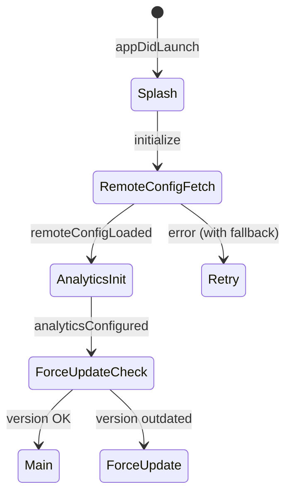
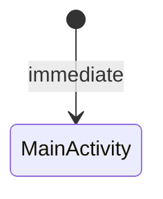

# Android/iOS Template Cross-Platform Analysis Report

This report analyzes the Android (`templates/android`) and iOS (`templates/ios`) templates for cross-platform consistency, identifying gaps in the Android implementation compared to iOS's comprehensive architecture.

---

## Executive Summary

| Feature | iOS | Android | Gap Level |
|---------|-----|---------|-----------|
| **App Lifecycle Management** | ✅ Comprehensive (`ApplicationLifecycle`, `AppReducer`) | ⚠️ Basic (`TmaApplication`) | 🔴 Critical |
| **Cold Start Sequence** | ✅ Full state machine with retry | ❌ Missing | 🔴 Critical |
| **Remote Config** | ✅ Firebase + Noop fallback (413 lines) | ❌ Missing | 🔴 Critical |
| **Deep Link Handling** | ✅ Comprehensive parser + routing | ❌ Missing | 🟡 Important |
| **Splash Screen** | ✅ Animated with transitions | ❌ Missing | 🟡 Important |
| **Force Update Check** | ✅ Version comparison + UI | ❌ Missing | 🟡 Important |
| **State Management** | ✅ TCA (Reducer + Store) | ✅ MVI (ViewModel + StateFlow) | ✅ Good |
| **Network Monitoring** | ✅ `NetworkMonitor` actor | ✅ `DefaultNetworkMonitor` Flow | ✅ Good |
| **Secure Storage** | ✅ `KeychainStorage` protocol | ✅ `EncryptedSecureStorage` | ✅ Good |
| **DI Framework** | ✅ TCA Dependencies | ✅ Hilt | ✅ Good |
| **UI Framework** | ✅ SwiftUI | ✅ Jetpack Compose | ✅ Good |

---

## Detailed Analysis

### 1. App Lifecycle Management

#### iOS Implementation
- **[AppDelegate.stencil](file:///Users/axient/repository/MGen/templates/ios/Templates/app/AppDelegate.stencil)**: Firebase initialization, deep link receiving, universal link handling
- **[ApplicationLifecycle.stencil](file:///Users/axient/repository/MGen/templates/ios/Templates/app/ApplicationLifecycle.stencil)**: TCA Reducer managing cold start sequence
- **[AppReducer.stencil](file:///Users/axient/repository/MGen/templates/ios/Templates/app/AppReducer.stencil)**: Root state machine with splash → forceUpdate → main transitions

```swift
// iOS: Comprehensive lifecycle states
@ObservableState
public struct State: Equatable, Sendable {
    public var phase: ScenePhase = .inactive
    public var isColdStartComplete = false
    public var isRemoteConfigLoaded = false
    public var analyticsConfigured = false
    public var lastStartupError: String?
}
```

#### Android Implementation
- **[TmaApplication.kt.j2](file:///Users/axient/repository/MGen/templates/android/templates/app/TmaApplication.kt.j2)**: Only basic Hilt initialization (23 lines)
- **[MainActivity.kt.j2](file:///Users/axient/repository/MGen/templates/android/templates/app/MainActivity.kt.j2)**: Immediate UI rendering without lifecycle awareness

```kotlin
// Android: Minimal implementation
@HiltAndroidApp
class TmaApplication : Application() {
    override fun onCreate() {
        super.onCreate()
        if (BuildConfig.DEBUG) {
            Log.d(TAG, "{{ cookiecutter.project_name }} initialized")
        }
    }
}
```

> [!CAUTION]
> **Critical Gap**: Android lacks lifecycle state management, scene phase handling, foreground/background transitions, and cold start retry logic.

---

### 2. Remote Config Service

#### iOS Implementation (413 lines)
- **[RemoteConfigServices.stencil](file:///Users/axient/repository/MGen/templates/ios/Templates/app/RemoteConfigServices.stencil)**:
  - `RemoteConfigService` protocol with async methods
  - `NoopRemoteConfigService` for fallback
  - `FirebaseRemoteConfigAdapter` with timeout handling
  - Network connectivity diagnostics
  - Thread-safe completion handling

```swift
// iOS: Protocol-based with fallback
public protocol RemoteConfigService: Sendable {
    func fetchAndActivate() async throws
    func getString(forKey key: String) -> String
    func getBool(forKey key: String) -> Bool
    // ...
}
```

#### Android Implementation
❌ **No RemoteConfigService exists**

> [!IMPORTANT]
> **Recommendation**: Create Android equivalent with:
> - `RemoteConfigRepository` interface
> - `FirebaseRemoteConfigRepository` implementation
> - `LocalRemoteConfigRepository` for offline/fallback
> - Hilt module for DI

---

### 3. Cold Start Sequence

#### iOS Implementation


#### Android Implementation


> [!WARNING]
> **Gap**: Android immediately shows MainActivity without any startup sequence, error handling, or version checking.

---

### 4. Deep Link Handling

#### iOS Implementation
- **[DeepLink.stencil](file:///Users/axient/repository/MGen/templates/ios/Templates/app/DeepLink.stencil)**: 187 lines with:
  - `DeepLinkStore` for pending URL management
  - `DeepLinkRoute` enum for type-safe routing
  - `DeepLinkParser` with multiple URL formats
  - Date parsing with multiple formatters

```swift
enum DeepLinkRoute: Equatable, Sendable {
    case today(date: Date?)
    case stats(date: Date?, mode: StatsViewMode?)
    case blockAdd(start: Date?, durationMinutes: Int?, type: TimeBlockType?, mode: BlockAddMode?)
    case blockEdit(id: String)
    case record(blockId: String)
}
```

#### Android Implementation
❌ **No deep link handling exists**

> [!NOTE]
> Android needs: `NavDeepLink`, intent filters in `AndroidManifest.xml`, and a `DeepLinkHandler` component.

---

### 5. Feature Module Pattern Comparison

| Aspect | iOS (TCA) | Android (MVI) |
|--------|-----------|---------------|
| State | `@ObservableState struct State` | `data class State` |
| Actions | `enum Action: Sendable` | `sealed interface Action` |
| Side Effects | Via `.send()` in Effect | Via `Channel<SideEffect>` |
| Reducer | `Reducer` protocol | ViewModel `onAction()` |
| Composition | `Scope`, child reducers | Not implemented |

Android's [FeatureViewModel.kt.j2](file:///Users/axient/repository/MGen/templates/android/templates/feature/FeatureViewModel.kt.j2) is well-structured but lacks parent-child composition like iOS's TCA scoping.

---

### 6. Shared/Core Module Comparison

| Module | iOS | Android |
|--------|-----|---------|
| Network | ✅ `NetworkMonitor.stencil` (NWPathMonitor) | ✅ `NetworkMonitor.kt.j2` (ConnectivityManager) |
| Storage | ✅ `KeychainStorage.stencil` | ✅ `SecureStorage.kt.j2` (EncryptedSharedPreferences) |
| Theme | ✅ In design system | ✅ `Theme.kt.j2` (Material3) |
| Database | ❌ (uses external) | ✅ `AppDatabase.kt.j2` (Room) |

---

## Recommendations

### 🔴 Critical (Must Have)

1. **Add Android Lifecycle Management**
   - Create `AppLifecycleViewModel` managing startup states
   - Add `LifecycleState` (splash, loading, error, ready, forceUpdate, main)
   - Implement retry logic for failed startup

2. **Add Android Remote Config**
   - Create `RemoteConfigRepository` interface
   - Implement Firebase wrapper with fallback
   - Add to cold start sequence

3. **Add Splash Screen**
   - Create `SplashScreen.kt` with Compose animations
   - Integrate with lifecycle ViewModel

### 🟡 Important (Should Have)

4. **Add Deep Link Support**
   - Define `DeepLinkRoute` sealed class
   - Create `DeepLinkParser` utility
   - Add intent filters to manifest
   - Integrate with Navigation component

5. **Add Force Update Check**
   - Add version comparison utility
   - Create `ForceUpdateScreen.kt`
   - Check against Remote Config value

### 🟢 Nice to Have

6. **Add Analytics Service Abstraction**
7. **Add Crash Reporting Abstraction**
8. **Add A/B Testing Support**

---

## Files to Create for Android

```
templates/android/templates/
├── app/
│   ├── AppLifecycleViewModel.kt.j2      # NEW: Lifecycle management
│   ├── SplashScreen.kt.j2               # NEW: Splash animation
│   ├── ForceUpdateScreen.kt.j2          # NEW: Update prompt
│   └── navigation/
│       └── DeepLinkHandler.kt.j2        # NEW: Deep link routing
├── core/
│   └── remoteconfig/
│       ├── RemoteConfigRepository.kt.j2  # NEW: Interface
│       ├── FirebaseRemoteConfig.kt.j2    # NEW: Firebase impl
│       └── LocalRemoteConfig.kt.j2       # NEW: Fallback
└── service/
    └── analytics/
        ├── AnalyticsService.kt.j2        # NEW: Interface
        └── FirebaseAnalytics.kt.j2       # NEW: Implementation
```

---

## Conclusion

The iOS templates are production-ready with comprehensive lifecycle management, while Android templates provide a solid foundation but lack the equivalent enterprise features. The gap is most critical in:

1. **Startup sequence reliability** (error handling, retry, fallback)
2. **Remote configuration** (feature flags, A/B testing)
3. **User experience** (splash screen, force update)

Addressing these gaps will ensure both platforms deliver a consistent, robust user experience.
