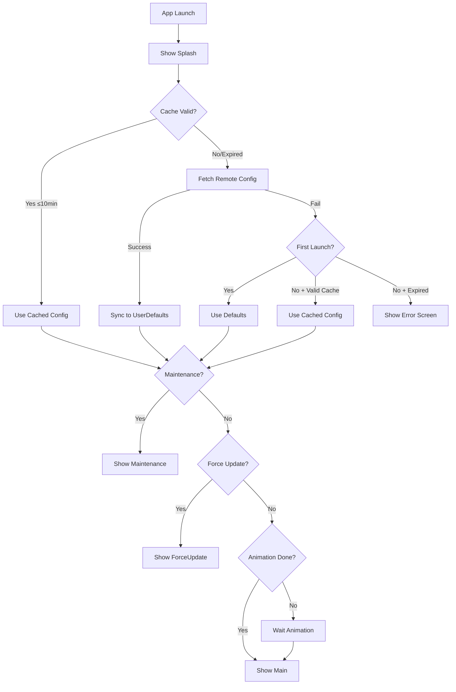

# iOS App Module Specification

## 1. 개요 (Overview)

TMA iOS 프로젝트의 **App 모듈**에 대한 기술 요구사항 명세서입니다.

### 1.1. 요구 기술 스택
| 항목 | 요구사항 |
|:---|:---|
| **Language** | Swift 6 (Strict Concurrency) |
| **UI Framework** | SwiftUI |
| **Architecture** | TCA 1.20+ (The Composable Architecture) |
| **Build System** | Tuist 4.119.1+ |
| **Minimum iOS** | iOS 17.0 |

### 1.2. 핵심 파일 구조
```
Projects/App/Sources/
├── App.swift              # @main 진입점 + RootView
├── AppDelegate.swift      # Firebase 초기화, 딥링크 수신
├── AppReducer.swift       # 루트 Reducer (상태 + 액션)
├── AppState.swift         # 전역 상태 관리자
├── AppComposition.swift   # DI 구성 (liveValue 등록)
├── AppConstants.swift     # Remote Config 키 등 상수
├── lifecycle/
│   └── ApplicationLifecycle.swift  # 시작 시퀀스 Reducer
├── ui/
│   ├── SplashView.swift
│   ├── MaintenanceView.swift
│   ├── ForceUpdateView.swift
│   ├── ErrorView.swift
│   └── MainScreenView.swift
└── deeplink/
    ├── DeepLink.swift          # URL 파싱 로직
    └── DeepLinkServices.swift  # DeepLinkClient
```

---

## 2. 앱 라이프사이클 (App Lifecycle)

### 2.1. 화면 상태 (RootViewState)

```swift
public enum RootViewState: Equatable, Sendable {
    case splash
    case maintenance(message: String)
    case forceUpdate(requiredVersion: String)
    case error(message: String)
    case main
}
```

| 우선순위 | 상태 | 트리거 조건 | 사용자 액션 |
|:---:|:---|:---|:---|
| 1 | `maintenance` | `isMaintenanceMode == true` | 재시도 버튼 |
| 2 | `forceUpdate` | `currentVersion < minimumVersion` | App Store 이동 |
| 3 | `error` | 캐시 만료 + 네트워크 실패 | 재시도 버튼 |
| 4 | `main` | 모든 검증 통과 + 스플래시 완료 | - |
| 5 | `splash` | 앱 시작 / 캐시 만료 후 Foreground | - |

### 2.2. Cold Start Sequence



### 2.3. Splash + Validation 동기화

스플래시 화면은 **두 조건이 모두 충족**될 때만 종료됩니다:

| 조건 | 소스 | 예상 시간 |
|:---|:---|:---|
| 스플래시 애니메이션 완료 | `SplashView.onComplete` | ~2.5초 |
| Remote Config 검증 완료 | `ApplicationLifecycle` | ~1-3초 |

```swift
// ApplicationLifecycle.State
var isReadyToTransition: Bool {
    isSplashAnimationComplete && isValidationComplete
}
```

### 2.4. Foreground 복귀

| 캐시 상태 | 동작 | UI 변화 |
|:---|:---|:---|
| 유효 (< 10분) | 캐시로 즉시 maintenance/forceUpdate 검증 | 없음 |
| 만료 (≥ 10분) | 스플래시 표시 + Remote Config 재fetch | Splash 표시 |

### 2.5. 에러 시나리오 매트릭스

| # | 상황 | 캐시 | 네트워크 | 결과 |
|:---:|:---|:---:|:---:|:---|
| 1 | 첫 실행 | ❌ | ✅ | 정상 fetch → 검증 → Main |
| 2 | 첫 실행 | ❌ | ❌ | 기본값 사용 → Main |
| 3 | 재실행 | ✅ 유효 | ✅/❌ | 캐시 사용 → 즉시 검증 |
| 4 | 재실행 | ⏰ 만료 | ✅ | fetch → 검증 → Main |
| 5 | 재실행 | ⏰ 만료 | ❌ | Error 화면 + 재시도 |
| 6 | Foreground | ✅ 유효 | - | 캐시로 즉시 검증 |
| 7 | Foreground | ⏰ 만료 | ✅ | Splash → fetch → Main |
| 8 | Foreground | ⏰ 만료 | ❌ | Error 화면 |
| 9 | Maintenance | - | - | 재시도 → 해제 시 Main |

---

## 3. Remote Config

### 3.1. 캐시 정책
| 설정 | 값 | 위치 |
|:---|:---|:---|
| 캐시 TTL | **10분 (600초)** | `CacheConfig.ttlSeconds` |
| 저장소 | UserDefaults | `AppStateKeys` |
| 타임스탬프 | Unix epoch (Double) | `lastRemoteConfigSyncTimestamp` |

### 3.2. 캐시 검증
```swift
private enum CacheConfig {
    static let ttlSeconds: TimeInterval = 600
}

var isCacheValid: Bool {
    guard hasCachedRemoteConfig else { return false }
    let elapsed = Date().timeIntervalSince1970 - lastRemoteConfigSyncTimestamp
    return elapsed < CacheConfig.ttlSeconds
}
```

### 3.3. 필수 Remote Config 키
| Key | Type | 기본값 | 용도 |
|:---|:---:|:---:|:---|
| `maintenance_mode_enabled` | Bool | `false` | Kill Switch |
| `maintenance_message` | String | `""` | 점검 안내 문구 (JSON 다국어 지원) |
| `force_update_min_version` | String | `""` | 최소 요구 버전 (e.g., "1.2.0") |
| `welcome_message` | String | `"Welcome!"` | 스플래시/메인 환영 메시지 (JSON 다국어 지원) |

> **Note:** Analytics는 항상 활성화됩니다. Remote Config로 제어하지 않습니다.

---

## 4. 버전 비교 로직

### 4.1. Semantic Versioning
```swift
// UpdateChecker
func isUpdateRequired(currentVersion: String, minimumVersion: String) -> Bool {
    guard !minimumVersion.isEmpty else { return false }
    return compareVersions(currentVersion, minimumVersion) == .orderedAscending
}
```

### 4.2. 비교 규칙
| 현재 버전 | 최소 버전 | 결과 |
|:---:|:---:|:---:|
| 1.0.0 | 1.0.0 | ✅ Pass |
| 1.0.1 | 1.0.0 | ✅ Pass |
| 1.0.0 | 1.0.1 | ❌ Force Update |
| 1.0.0 | 2.0.0 | ❌ Force Update |
| 1.0.0 | (empty) | ✅ Pass |

---

## 5. AppStateClient (TCA Dependency)

### 5.1. 접근 규칙
> ⚠️ `AppState.shared` 직접 접근 금지. `@Dependency(\.appState)` 사용.

### 5.2. 캐시 상태 API
| 메서드 | 타입 | 설명 |
|:---|:---|:---|
| `hasCachedRemoteConfig()` | `async -> Bool` | 캐시 존재 여부 |
| `isCacheValid()` | `async -> Bool` | TTL 내 유효성 |
| `lastRemoteConfigSyncTimestamp()` | `async -> TimeInterval` | 마지막 동기화 시간 |

### 5.3. Remote Config 동기화
```swift
func syncFromRemoteConfig(_ service: any RemoteConfigService) {
    forceUpdateMinimumVersion = service.getString(forKey: .forceUpdateMinVersion)
    isMaintenanceMode = service.getBool(forKey: .maintenanceModeEnabled)
    maintenanceMessage = service.getString(forKey: .maintenanceMessage)
    welcomeMessage = service.getString(forKey: .welcomeMessage)
    lastRemoteConfigSyncTimestamp = Date().timeIntervalSince1970
}
```

---

## 6. 딥링크 (Deep Link)

### 6.1. 지원 스킴
| 유형 | 형식 |
|:---|:---|
| Custom Scheme | `{{ name | lowercase }}://path` |
| Universal Link | `https://{{ domain }}/path` |

### 6.2. 라우트
```swift
public enum DeepLinkRoute: Equatable, Sendable {
    case home(date: Date?)
    case stats(date: Date?, mode: StatsViewMode?)
    case itemDetail(id: String)
    case addItem(start: Date?, durationMinutes: Int?, type: ItemType?)
    case settings
    case unknown(path: String)
}
```

### 6.3. 처리 흐름
1. `AppDelegate` → URL 수신 → `DeepLinkStore.publish()`
2. `App.swift` → `onOpenURL` → `store.send(.view(.deepLinkReceived(url)))`
3. `AppReducer` → `DeepLinkClient.parse()` + `handleDeepLink()`

---

## 7. Swift 6 Concurrency

### 7.1. Actor Isolation
```swift
@MainActor
@Observable
final class AppState {
    fileprivate static let shared = AppState()
    // ...
}
```

### 7.2. @DependencyClient Pattern
```swift
@DependencyClient
public struct AppStateClient: Sendable {
    public var isCacheValid: @Sendable () async -> Bool = { false }
    public var syncFromRemoteConfig: @Sendable (any RemoteConfigService) async -> Void = { _ in }
    // ...
}
```

### 7.3. Sendable Helper
```swift
@Sendable func run<T: Sendable>(_ block: @MainActor @Sendable () -> T) async -> T {
    await MainActor.run { block() }
}
```

---

## 8. UI 화면 명세

| 화면 | 파일 | 주요 기능 |
|:---|:---|:---|
| **SplashView** | `SplashView.swift` | 브릭 애니메이션 (~2.5초), `welcomeMessage` 표시, 완료 시 action 전송 |
| **MaintenanceView** | `MaintenanceView.swift` | 점검 메시지 표시, 재시도 버튼 |
| **ForceUpdateView** | `ForceUpdateView.swift` | 최소 버전 안내, App Store 링크 (`itms-apps://`) |
| **ErrorView** | `App.swift` | 네트워크 오류 메시지, 재시도 버튼 |
| **MainScreenView** | `MainScreenView.swift` | 앱 메인 콘텐츠, Remote Config 상태 표시 |

---

## 9. 다국어 지원 (Localization)

### 9.1. Remote Config 다국어 형식

Remote Config의 텍스트 값은 **JSON 형식**으로 여러 언어를 지원합니다:

```json
{
  "ko": "한국어 메시지",
  "en": "English message",
  "ja": "日本語メッセージ"
}
```

### 9.2. LocalizedRemoteConfig

`LocalizedRemoteConfig.swift`는 JSON 기반 다국어 값을 파싱합니다:

```swift
// 사용 예시
let rawValue = remoteConfigService.getString(forKey: "maintenance_message")
let languageCode = await appState.effectiveLanguageCode()
let localized = LocalizedRemoteConfig.localize(rawValue, forLanguage: languageCode)
```

### 9.3. AppState 다국어 API

| 프로퍼티 | 타입 | 설명 |
|:---|:---|:---|
| `userLanguageCode` | String | 사용자가 선택한 언어 (appStorage 저장) |
| `effectiveLanguageCode` | String | 실제 사용 언어 (userLanguageCode 또는 디바이스 언어) |
| `localizedWelcomeMessage` | String | 다국어 처리된 환영 메시지 |
| `localizedMaintenanceMessage` | String | 다국어 처리된 점검 메시지 |

### 9.4. Fallback 정책

1. 사용자 선택 언어 (`userLanguageCode`)
2. 영어 (`en`)
3. 빈 문자열 (`""`)

---

## 10. 상태 관리 전략

### 10.1. Persistent State (영구 저장)

`@Shared(.appStorage)`를 사용하여 앱 재시작 후에도 유지:

| 키 | 타입 | 용도 |
|:---|:---:|:---|
| `forceUpdateMinimumVersion` | String | 최소 요구 버전 |
| `isMaintenanceMode` | Bool | 점검 모드 플래그 |
| `maintenanceMessage` | String | 점검 메시지 |
| `welcomeMessage` | String | 환영 메시지 |
| `lastRemoteConfigSyncTimestamp` | Double | 마지막 동기화 시간 |
| `userLanguageCode` | String | 사용자 언어 설정 |

### 10.2. Volatile State (휘발성 저장)

`@Shared(.inMemory)`를 사용하여 앱 재시작 시 초기화:

| 키 | 타입 | 용도 |
|:---|:---:|:---|
| `selectedTabIndex` | Int | 현재 선택된 탭 |
| `isShowingOnboarding` | Bool | 온보딩 표시 여부 |
| `lastViewedScreen` | String | 마지막 본 화면 |
| `isInForeground` | Bool | 앱 포그라운드 상태 |
| `latestStoreVersion` | String? | App Store 최신 버전 |
| `isSplashAnimationComplete` | Bool | Splash 애니메이션 완료 |
| `isValidationComplete` | Bool | 검증 완료 |

### 10.3. 상태 초기화 API

```swift
// Volatile state만 초기화
await appState.resetVolatileState()

// 모든 persistent state 삭제 (위험!)
await appState.clearPersistentState()
```

---

## 11. 딥링크 고급 기능

### 11.1. Deferred Deep Link

첫 실행 시 딥링크를 저장하여 나중에 처리:

```swift
// 저장
await deepLink.saveDeferredDeepLink(url, source: .universalLink)

// 확인
let hasPending = await deepLink.hasDeferredDeepLink()

// 소비 (가져오고 삭제)
if let deferred = await deepLink.consumeDeferredDeepLink() {
    // 처리
}
```

### 11.2. Deep Link Source Tracking

```swift
public enum Source: String, Codable, Sendable {
    case universalLink
    case customScheme
    case pushNotification
    case clipboard
}
```

### 11.3. URL Builder

라우트를 URL로 변환:

```swift
let route = DeepLinkRoute.stats(date: Date(), mode: .week)
let url = route.toURL()  // "myapp://stats?date=2024-01-01&mode=week"
```

---

## 12. Firebase 연동 세부사항

### 12.1. GoogleService-Info.plist 검증

`AppDelegate.swift`는 자동으로 Placeholder 파일을 감지:

```swift
// Placeholder 체크
guard plist["PLACEHOLDER"] == nil,
      plist["GOOGLE_APP_ID"] != nil else {
    logger.warning("⚠️ GoogleService-Info.plist not found or is placeholder.")
    return
}
```

### 12.2. Remote Config 타임아웃 처리

`RemoteConfigServices.swift`는 타임아웃 시 자동 진단:

- Firebase Remote Config API 도달성 테스트
- Firebase Installations API 도달성 테스트
- 네트워크 상태 모니터링 (NWPathMonitor)

### 12.3. Remote Config 설정

| 설정 | 기본값 | 설명 |
|:---|:---:|:---|
| `fetchTimeout` | 60초 | Fetch 작업 최대 대기 시간 |
| `minimumFetchInterval` | 600초 (10분) | 최소 fetch 간격 (개발 시 0으로 설정 가능) |

---

## 13. 앱 상수 관리

### 13.1. AppConstants

`AppConstants.swift`에 모든 상수를 중앙 관리:

```swift
enum AppConstants {
    enum RemoteConfig {
        static let forceUpdateMinimumVersionKey = "force_update_min_version"
        static let welcomeMessageKey = "welcome_message"
        static let maintenanceModeEnabledKey = "maintenance_mode_enabled"
        static let maintenanceMessageKey = "maintenance_message"
    }

    enum Analytics {
        static let sampleEventName = "app_sample_event"
        static let sampleEventSourceKey = "source"
    }

    enum App {
        static let appStoreId = ""  // TODO: 앱별로 설정
        static let bundleIdPrefix = "{{ bundleIdPrefix }}"
        static let appName = "{{ name }}"
    }
}
```

### 13.2. UpdateChecker App Store URL

`UpdateChecker.swift`는 `appStoreId`를 생성자로 받습니다:

```swift
let checker = DefaultUpdateChecker(appStoreId: "1234567890")
let storeURL = checker.storeURL  // https://apps.apple.com/app/id1234567890
```

**appStoreId가 비어있을 때:**
- Generic App Store URL로 자동 폴백 (`https://apps.apple.com`)
- Force Update 화면은 정상 작동하나, 일반 App Store 페이지로 이동

> **권장사항:** 앱 출시 후 App Store ID를 받으면 `AppConstants.App.appStoreId`를 업데이트

---

## 14. 테스트 및 샘플 모듈

### 14.1. 제공되는 샘플

템플릿은 다음 샘플 모듈을 포함합니다:

1. **DailyAction Domain** - 도메인 모델 예제
2. **DailyActionList Feature** - TCA 기반 Feature 예제
3. **AppDataService** - SQLite 기반 Repository 예제

### 14.2. 아키텍처 가이드

생성된 프로젝트는 다음 문서를 포함:

- `MODULE_SCAFFOLD_GUIDE.md` - 새 모듈 생성 가이드
- `SWIFT6_TCA_INTEGRATION.md` - Swift 6 + TCA 통합 가이드
